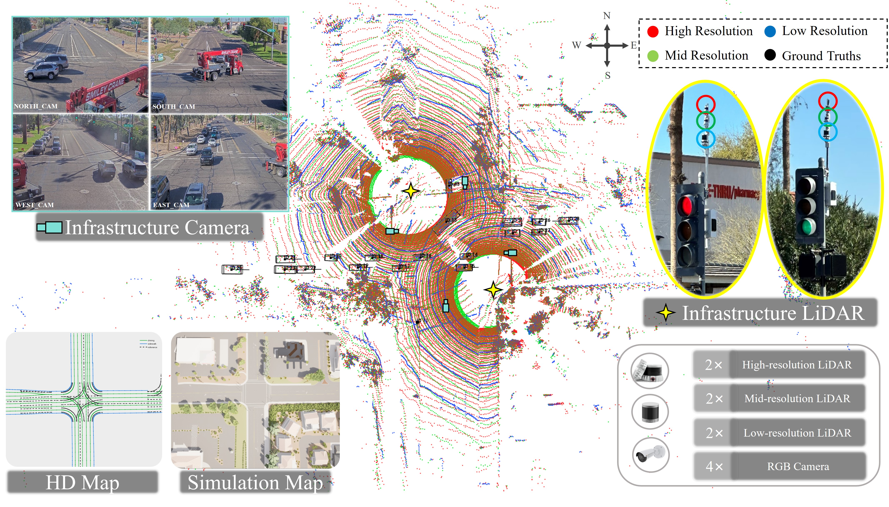

# RESOLVE: A Multi-Resolution and Multi-Modal Dataset for Roadside Cooperative Perception
[ECCV 2026] The official codebase for the paper "RESOLVE: A Multi-Resolution and Multi-Modal Dataset for Roadside Cooperative Perception"



---

## 📢 Announcements
Stay up to date with the latest news, updates, and important notices regarding RESOLVE:

- **`2026/06/18`**: Paper accepted at ECCV 2026 🎉.
- **`2026/06/20`**: The v0.1.0 dataset and benchmark code for 3D object detection are released. The currently supported detection models are as follows: [PointPillars](https://arxiv.org/abs/1812.05784), [SECOND](https://www.mdpi.com/1424-8220/18/10/3337), [CenterPoint](https://arxiv.org/abs/2006.11275), [TransFusion](https://arxiv.org/abs/2203.11496), [VoxSeT](https://arxiv.org/abs/2203.10314), [DSVT](https://arxiv.org/abs/2301.06051), [Voxel Mamba](https://arxiv.org/abs/2406.10700), [LION](https://arxiv.org/abs/2407.18232), [BEVFusion](https://arxiv.org/abs/2205.13542), [UniTR](https://arxiv.org/abs/2308.07732)
- **`2026/06/22`**: The benchmark code for 3D multi-object tracking is released. The currently supported tracking models are as follows: [AB3DMOT](https://arxiv.org/abs/2008.08063), [CenterPoint](https://arxiv.org/abs/2006.11275), [SimpleTrack](https://arxiv.org/abs/2111.09621), [Poly-MOT](https://arxiv.org/abs/2307.16675), [MCTrack](https://arxiv.org/abs/2409.16149)
- **`2026/06/24`**: The benchmark code for agent-level cooperative perception is released. The currently supported cooperative models are as follows: [AttFuse]([https://arxiv.org/abs/2008.08063](https://arxiv.org/abs/2109.07644)), [F-Cooper](https://arxiv.org/abs/1909.06459), [CoBEVT](https://arxiv.org/abs/2207.02202), [V2X-ViT](https://arxiv.org/abs/2203.10638)
## ✅ TODO

- [x] Release the RESOLVE dataset
- [x] Release the benchmark code for 3D object detection
- [x] Release the benchmark code for 3D multi-object tracking
- [x] Release the benchmark code for cooperative perception


## 🔓 Data Download
You can download the v0.1.0 dataset via this [Dropbox link](https://www.dropbox.com/scl/fo/dyopemtv8wp1gdqibv3xq/AOSzowru0Kv_DXkzGbUyHd0?rlkey=9g0fjo1w6qlqxozfrcakfbwx3&st=hs8n9tik&dl=0).

After downloading the data, please put the data in the following structure:
```
DATA_ROOT
├── data
│   ├── sunlakes
│   │   │   │── 📂 2026-01-04_18_02_01-export
│   │   │   │   │── 📂 rosbag2_2025_10_14-07_21_21
│   │   │   │   │   │── 📂 16_16b_sync
│   │   │   │   │   │    │── 📄 1760451628-250275702.bin # point cloud fused by two low resolution lidar
│   │   │   │   │   │    └   ...
│   │   │   │   │   │── 📂 64_64b_sync
│   │   │   │   │   │── 📂 128_128b_sync
│   │   │   │   │   │── 📂 ouster64b_sync
│   │   │   │   │   │    │── 📄 1760451628-250275702.bin # point cloud captured by the low-resolution LiDAR at the northwest corner of the intersection
│   │   │   │   │   │    └   ...
│   │   │   │   │   │── 📂 ouster64_sync
│   │   │   │   │   │── 📂 ouster128b_sync
│   │   │   │   │   │── 📂 ouster128_sync
│   │   │   │   │   │── 📂 rslidar16b_sync
│   │   │   │   │   │── 📂 rslidar16_sync
│   │   │   │   │   │── 📂 axis1_sync
│   │   │   │   │   │    │── 🖼️ 1760451681-076657049.jpg # image captured by the camera located south of the intersection.
│   │   │   │   │   │    └   ...
│   │   │   │   │   │── 📂 axis2_sync
│   │   │   │   │   │── 📂 axis3_sync
│   │   │   │   │   │── 📂 axis4_sync
│   │   │   │   │   │── 📂 calibration_txt
│   │   │   │   │   │    │── 📂 axis1__ouster128b
│   │   │   │   │   │    │    │── 📊 1760451681-076657049__1760451628-150432431_calibration.txt
│   │   │   │   │   │    │    └   ...
│   │   │   │   │   │    │── 📂 axis2__ouster128b
│   │   │   │   │   │    │── 📂 axis3__ouster128b
│   │   │   │   │   │    │── 📂 axis4__ouster128b
│   │   │   │   │── 📊 HSQJN_3.json # annotation information file
│   │   │   │   └   ...
│   │   │   └   ...
├── pcdet
├── tools
```

## 🏋️ Getting Started
### Requirements
All the codes are tested in the following environment:
* Ubuntu 22.04
* Python 3.10.19
* PyTorch 2.8.0
* CUDA 12.8
* [`spconv v2.x`](https://github.com/traveller59/spconv)

### 3D Object Detection
We implement 3d object detection based on OpenPCDet. Please follow [OpenPCDet's official instructions](https://github.com/open-mmlab/OpenPCDet/blob/master/docs/INSTALL.md) to set up the environment first. Please note that for Voxel Mamba and LION, you need to install mamba-ssm separately by following the [instruction](https://github.com/happinesslz/LION/blob/main/docs/INSTALL.md).

Then generate the data infos by running the following command and data at different resolutions can be generated by setting the `sensor_type` parameter:
```bash
#  os128: high-resolution LiDAR data, os64: medium-resolution LiDAR data, rs16: low-resolution LiDAR data
python tools/create_sunlakes_data_v3.py --data_root ../data/sunlakes  --sensor_type os128 
```

After generating the data infos, organize the data to follow the nuScenes directory structure:
```
DATA_ROOT
├── data
│   ├── sunlakes
│   │   │   │── 📂 2026-01-04_18_02_01-export
│   │   │   │   │── 📂 v1.0-trainval
│   │   │   │   │   │── 📂 sunlakes_gt_database
│   │   │   │   │   │    │── 📄 0_car_0.bin
│   │   │   │   │   │    └   ...
│   │   │   │   │   │── 📂 sunlakes_img_gt_database
│   │   │   │   │   │    │── 🖼️ 0_car_0.jpg
│   │   │   │   │   │    └   ...
│   │   │   │   │   │── 📊 sunlakes_infos_train.pkl
│   │   │   │   │   │── 📊 sunlakes_infos_val.pkl
│   │   │   │   │   │── 📊 sunlakes_dbinfos_train.pkl
│   │   │   │── 📂 lidar_pc_with_ts  # each point cloud segment is rotated to fit within a regular rectangular region.
│   │   │   │   │── 📂 rosbag2_2025_10_14-07_21_21
│   │   │   │   │   │── 📂 16_16b_sync  # the resolution of the generated LiDAR data is controlled by the `sensor_type` parameter.
│   │   │   │   │   │    │── 📄 1760451628-250275702.bin
│   │   │   │   │   │    └   ...
│   │   │   │   └   ...
├── pcdet
├── tools
```

When training a model at a specific resolution, ensure that `DATA_PATH` in `cfgs/dataset_configs/sunlakes_dataset.yaml` is set to the directory corresponding to that resolution.
```shell script
# train with multiple GPUs
sh scripts/dist_train.sh 4 --cfg_file cfgs/sunlakes_models/bevfusion.yaml

# train with a single GPU:
python train.py --cfg_file ${CONFIG_FILE}
```

To test and evaluate the pretrained models:
```shell script
# test with multiple GPUs
sh scripts/dist_test.sh 4 --cfg_file ${CONFIG_FILE} --batch_size ${BATCH_SIZE} --ckpt ${CKPT}
```

### 3D Multi-Object Tracking
As a prerequisite, the object detection algorithm should be executed to generate the corresponding detection results `results_nusc.json`. Also refer to the original repositories for instructions on setting up the environments required by each tracking algorithm.

After setup, replace the paths for `data_root` and `pred_json` with the local paths on your machine, and then run tracking script:
```bash
cd mot/MCTrack
# training and evaluation
python tracking.py --data_root your_path/sunlakes_infos_train.pkl --pred_json your_path/results_nusc.json
```

### Cooperative Perception
We implement agent-level cooperative perception based on OpenCOOD. Please follow [OpenCOOD's official instructions](https://opencood.readthedocs.io/en/latest/md_files/installation.html) to set up the environment first.

Next, run the following commands to generate the data infos. By configuring the `ego_sensor` and `cooperative_agents` parameters, you can generate data for different agents and LiDAR resolutions.
```bash
cd cooperative/opencood/
#  os128/os128b: high-resolution LiDAR agents, os64/os64b: medium-resolution LiDAR agents, rs16/rs16b: low-resolution LiDAR agents
python tools/create_sunlakes_opencood.py --data_root ../data/sunlakes  --output_root your_output_path --ego_sensor os128b --cooperative_agents os128
```

After generating the data infos, organize the data to follow the directory structure:
```
DATA_ROOT
├── data
│   ├── sunlakes
│   │   │   │── 📂 your_output_path
│   │   │   │   │── 📂 train
│   │   │   │   │   │── 📂 2026-01-04_18_02_01-export__68fce85d185a9dc2c167cae6 
│   │   │   │   │   │    │── 📂 0 # ego_sensor data
│   │   │   │   │   │    │    │── 📄 1760718487-550083650.pcd  # point cloud from one agent at a specific timestamp
│   │   │   │   │   │    │    │── 📄 1760718487-550083650.yaml # label information from one agent at a specific timestamp
│   │   │   │   │   │    │    └   ...
│   │   │   │   │   │    │── 📂 1 # cooperative_agents data
│   │   │   │   │   └   ...
│   │   │   │   │── 📂 validate
│   │   │   │   │── 📂 openpcdet_eval # used to support OpenPCDet-style evaluation.
│   │   │   │   │   │── 📂 v1.0-trainval
│   │   │   │   │   │    │── 📊 sunlakes_infos_train.pkl
│   │   │   │   │   │    │── 📊 sunlakes_infos_val.pkl
├── pcdet
├── tools
```

We provide a script for training various cooperative perception methods on the RESOLVE dataset. Before training, update `root_dir` and `validate_dir` in the corresponding configuration files under `cooperative/opencood/hypes_yaml` with the local dataset paths on your machine. 

For example, to train a model using 4 GPUs:
```shell script
#  MODEL: no_fusion | late_fusion | early_fusion | attentive_fusion | fcooper | cobevt | v2xvit
sh run_sunlakes_4gpu.sh train ${MODEL}
```

## 🔍 Models Zoo

###  3D Object Detection Benchmarks

| Model        | Modality       | LiDAR Backbone       |   Low Resolution     | Mid Resolution     | High Resolution    |
|------------- |----------------|----------------------|----------------------|--------------------|--------------------|
| [PointPillars](tools/cfgs/sunlakes_models/pointpillar.yaml) | LiDAR          | Sparse Convolution   | 75.1 / 71.2          | 79.7 / 72.6        | 80.6 / 73.6        |
| [SECOND](tools/cfgs/sunlakes_models/second.yaml)       | LiDAR          | Sparse Convolution   | 68.2 / 66.5          | 76.6 / 71.2        | 78.0 / 73.1        |
| [CenterPoint](tools/cfgs/sunlakes_models/centerpoint.yaml)  | LiDAR          | Sparse Convolution   | 79.9 / 73.9          | 86.4 / 79.9        | 87.4 / 80.9        | 
| [TransFusion-L](tools/cfgs/sunlakes_models/transfusion.yaml)| LiDAR          | Sparse Convolution   | 82.5 / 76.3          | 86.6 / 80.1        | 89.1 / 82.4        | 
| [VoxSeT](tools/cfgs/sunlakes_models/voxset.yaml)       | LiDAR          | Transformer          | 87.4 / 82.9          | 89.1 / 81.6        | 90.1 / 83.1        |
| [DSVT](tools/cfgs/sunlakes_models/dsvt.yaml)         | LiDAR          | Transformer          | 85.9 / 81.5          | 94.1 / 87.0        | 94.6 / 87.5        | 
| [Voxel Mamba](tools/cfgs/sunlakes_models/voxel_mamba.yaml)  | LiDAR          | Mamba                | 85.7 / 81.7          | 94.9 / 88.5        | 95.4 / 89.1        | 
| [LION](tools/cfgs/sunlakes_models/lion.yaml)| LiDAR          | Mamba                | 88.1 / 84.2          | 95.1 / 89.8        | 95.9 / 91.1        |
| [BEVFusion](tools/cfgs/sunlakes_models/bevfusion.yaml)    | LiDAR + Camera | Sparse Convolution   | 86.3 / 79.8          | 92.6 / 84.8        | 93.1 / 86.4        | 
| [UniTR](tools/cfgs/sunlakes_models/unitr.yaml)        | LiDAR + Camera | Transformer          | 89.7 / 83.7          | 94.4 / 87.3        | 94.9 / 87.4        |

###  Agent-level Cooperative Perception Benchmarks

| Model        |   Low Resolution     | Mid Resolution     | High Resolution    |
|--------------|----------------------|--------------------|--------------------|
| [No Fusion](cooperative/opencood/hypes_yaml/sunlakes_point_pillar_no_fusion.yaml)      | 31.6          | 50.3        | 52.9        |
| [Early Fusion](cooperative/opencood/hypes_yaml/sunlakes_point_pillar_early_fusion.yaml)        | 48.6          | 61.0        | 66.0        |
| [Late Fusion](cooperative/opencood/hypes_yaml/sunlakes_point_pillar_late_fusion.yaml)    | 31.0          | 56.8        | 58.0        | 
| [AttFuse](cooperative/opencood/hypes_yaml/sunlakes_point_pillar_attentive_fusion.yaml)        | 43.7          | 67.4        | 72.9        | 
| [F-Cooper](cooperative/opencood/hypes_yaml/sunlakes_point_pillar_fcooper.yaml)            | 36.8          | 63.2        | 68.9        |
| [CoBEVT](cooperative/opencood/hypes_yaml/sunlakes_point_pillar_cobevt.yaml)                | 43.5          | 64.0        | 69.5        | 
| [V2X-ViT](cooperative/opencood/hypes_yaml/sunlakes_point_pillar_v2xvit.yaml)        | 43.0          | 67.5        | 71.5        | 
--- 
## 📝 License

- **Code**: Licensed under the **MIT** License. See [LICENSE](LICENSE) file for details.

- **Dataset**: Licensed under the Creative Commons Attribution 4.0 International [CC BY-NC-ND 4.0](https://creativecommons.org/licenses/by-nc-nd/4.0/deed.en). You must give appropriate credit; Cannot be used for commercial purposes; You may not distribute modified versions of the dataset.
--- 
